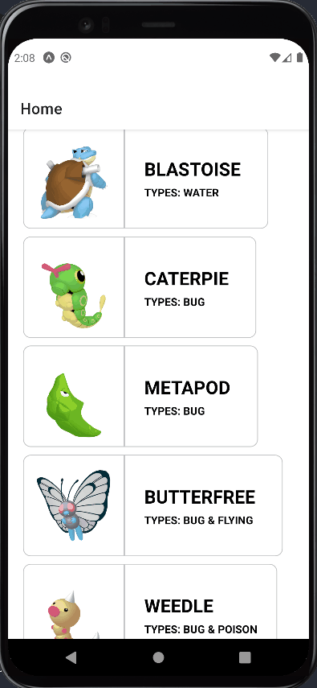

<h1 align='center'>
  

  
</h1>
<p align="center">Repositório do Teste Técnico em React Native da Bravi</p>

### Acesso Rápido

- <a href="#demonstração">Demonstração</a>
- <a href="#tecnologias">Tecnologias</a>
- <a href="#explicando-escolha-das-tecnologias">Explicando Escolha das Tecnologias</a>
- <a href="#prrequisitos">Pré Requisitos</a>
- <a href="#rodando-o-app">Rodando o App</a>
- <a href="#build-app">Build App</a>

---

### Demonstração



<br>

### Tecnologias

Abaixo estão as tecnologias e bibliotecas mais complexas utilizadas neste projeto.

- [Expo](https://docs.expo.dev/get-started/installation/)
- [React Native](https://reactnative.dev/docs/getting-started)
- [React Navigation](https://reactnavigation.org/docs/getting-started/)
- [Axios](https://axios-http.com/)
- [React Native Iphone X Helper](https://github.com/ptelad/react-native-iphone-x-helper)
- [React Native Responsive Fontsize](https://github.com/heyman333/react-native-responsive-fontSize)
- [Styled Components](https://styled-components.com/)

<br>

### Explicando Escolha das Tecnologias

1. Decidi escolher o Expo pela facilidade de gerar um aplicativo tanto para IOS ou Android (visto que o leitor possa ter um IOS).

2. Decidi usar o Axios para a requisição HTTP pelo motivo da simplicidade, código limpo e facilitação nas requisições.

3. Ao invés de escolher o SafeAreaView para garantir evitar pegar a barra de status do celular, utilizei o React Native Iphone X Helper no qual ele de forma simples identifica se o celular é android ou IOS (pois assim tem uma diferença). Mesmo sendo possivel de fazer isso nativamente preferi usar uma biblioteca para evitar possiveis bugs etc.

4. Visando responsividade nas fontes escolhi a lib React Native Responsive Fontsize pois ela faz o calculo automáticamente baseado no DP de cada celular.

5. O Styled-Components sem dúvida faz uma enorme diferença no código deixando ele bem mais limpo e bem mais entendivel, criando componentes estilizaveis.

### Pré-requisitos

Uma observação muito importante é que para rodar o app é importante ter em seu celular o App do [Expo (Clique aqui para Baixar)](https://play.google.com/store/apps/details?id=host.exp.exponent)

E também ter instalado em sua máquina as seguintes ferramentas: [Expo CLI](https://docs.expo.dev/get-started/installation/),
[Git](https://git-scm.com), [Node.js](https://nodejs.org/pt-br/).

Além disto é bom ter um editor para trabalhar com o código como o [VSCode](https://code.visualstudio.com/)

<br>

### Rodando o App

```bash
  # Clone este repositório
  $ git clone https://github.com/CaueFidelis/bravi-challenge.git

  # Acesse a pasta do projeto no terminal/cmd
  $ cd bravi-challenge

  # Instale as dependências
  $ yarn

  # Execute a aplicação em modo de desenvolvimento
  $ yarn start

  # Abra o app do Expo no seu celular e leia o QR CODE
  # Aperte a tecla A no terminal para rodar no seu emulador Android
```

<br>

### Build App

É necessário saber que para fazer a Build pelo Expo é preciso ter uma conta no Expo.

Então caso queira o arquivo para instalar em seu celular está na pasta /builds na raiz do projeto.

```bash
  # Faca o Build para Android
  $ expo build:android

  # Faca o Build para IOS
  $ expo build:ios
```
